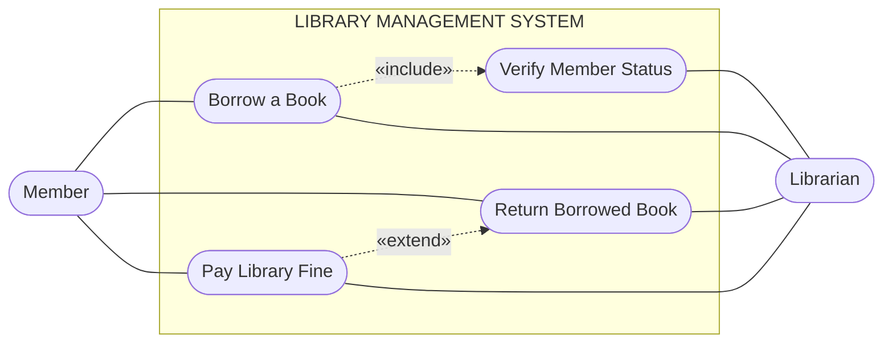

```mermaid
flowchart LR

    M([Member])

    subgraph LMS["LIBRARY MANAGEMENT SYSTEM"]
        direction TB

        UC1(["Borrow a Book"])
        UC2(["Return Borrowed Book"])
        UC3(["Pay Library Fine"])
        UC4(["Verify Member Status"])

        UC1 -.->|«include»| UC4
        UC3 -.->|«extend»| UC2
    end

    L([Librarian])

    M --- UC1
    M --- UC2
    M --- UC3

    UC1 --- L
    UC2 --- L
    UC3 --- L
    UC4 --- L
```